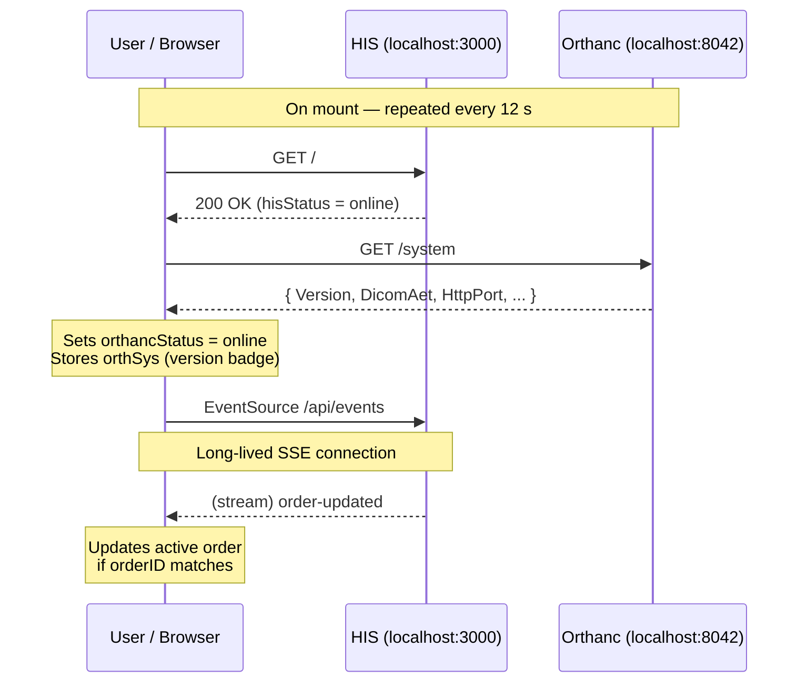

# A. System Startup

Runs on mount and repeats every 12 seconds. Checks both HIS and Orthanc connectivity, then opens a long-lived SSE stream for real-time order updates.

```mermaid
sequenceDiagram
    participant U as User / Browser
    participant HIS as HIS (localhost:3000)
    participant ORT as Orthanc (localhost:8042)

    Note over U,ORT: On mount — repeated every 12 s

    U->>HIS: GET /
    HIS-->>U: 200 OK (hisStatus = online)

    U->>ORT: GET /system
    ORT-->>U: { Version, DicomAet, HttpPort, ... }
    Note over U: Sets orthancStatus = online<br/>Stores orthSys (version badge)

    U->>HIS: EventSource /api/events
    Note over U,HIS: Long-lived SSE connection
    HIS-->>U: (stream) order-updated
    Note over U: Updates active order<br/>if orderID matches
```
