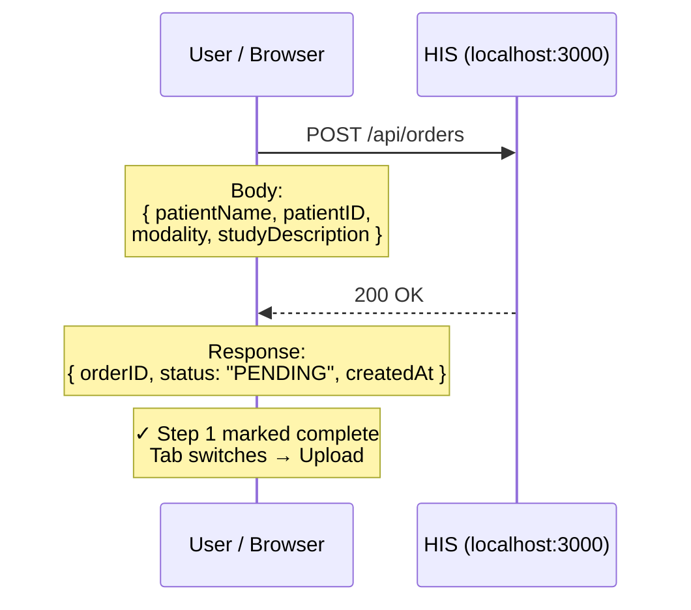

# B. Step 1 — Create Imaging Order

User fills in patient details and submits the order form. HIS creates the order with status `PENDING` and returns the assigned `orderID`.

```mermaid
sequenceDiagram
    participant U as User / Browser
    participant HIS as HIS (localhost:3000)

    U->>HIS: POST /api/orders
    Note over U: Body:<br/>{ patientName, patientID,<br/>  modality, studyDescription }

    HIS-->>U: 200 OK
    Note over U: Response:<br/>{ orderID, status: "PENDING", createdAt }

    Note over U: ✓ Step 1 marked complete<br/>Tab switches → Upload
```
