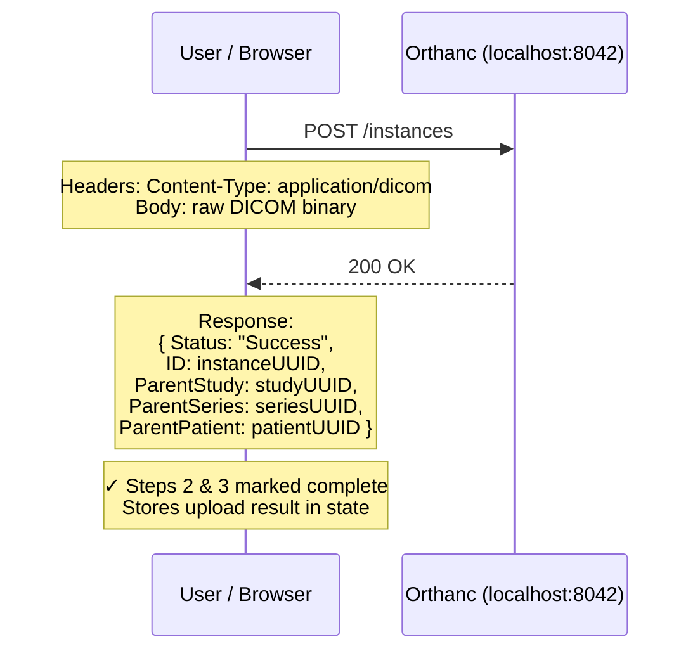

# C. Step 2 — Upload DICOM to Orthanc

Raw DICOM binary is posted directly to Orthanc. The response contains the Orthanc-assigned internal UUIDs for the instance, series, study, and patient.

```mermaid
sequenceDiagram
    participant U as User / Browser
    participant ORT as Orthanc (localhost:8042)

    U->>ORT: POST /instances
    Note over U: Headers: Content-Type: application/dicom<br/>Body: raw DICOM binary

    ORT-->>U: 200 OK
    Note over U: Response:<br/>{ Status: "Success",<br/>  ID: instanceUUID,<br/>  ParentStudy: studyUUID,<br/>  ParentSeries: seriesUUID,<br/>  ParentPatient: patientUUID }

    Note over U: ✓ Steps 2 & 3 marked complete<br/>Stores upload result in state
```
