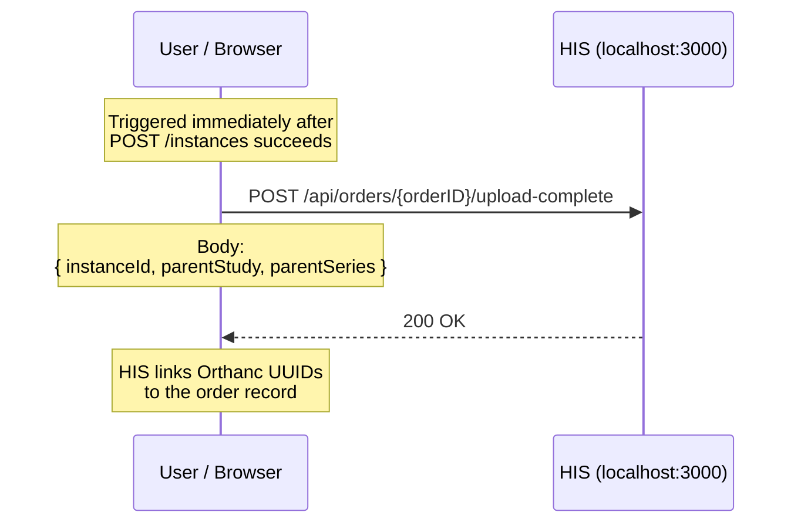

# D. Step 3 — HIS Acknowledges Upload

After a successful DICOM upload, the UI notifies HIS with the Orthanc-assigned identifiers so HIS can link the order to the stored instance.

```mermaid
sequenceDiagram
    participant U as User / Browser
    participant HIS as HIS (localhost:3000)

    Note over U: Triggered immediately after<br/>POST /instances succeeds

    U->>HIS: POST /api/orders/{orderID}/upload-complete
    Note over U: Body:<br/>{ instanceId, parentStudy, parentSeries }

    HIS-->>U: 200 OK
    Note over U: HIS links Orthanc UUIDs<br/>to the order record
```
