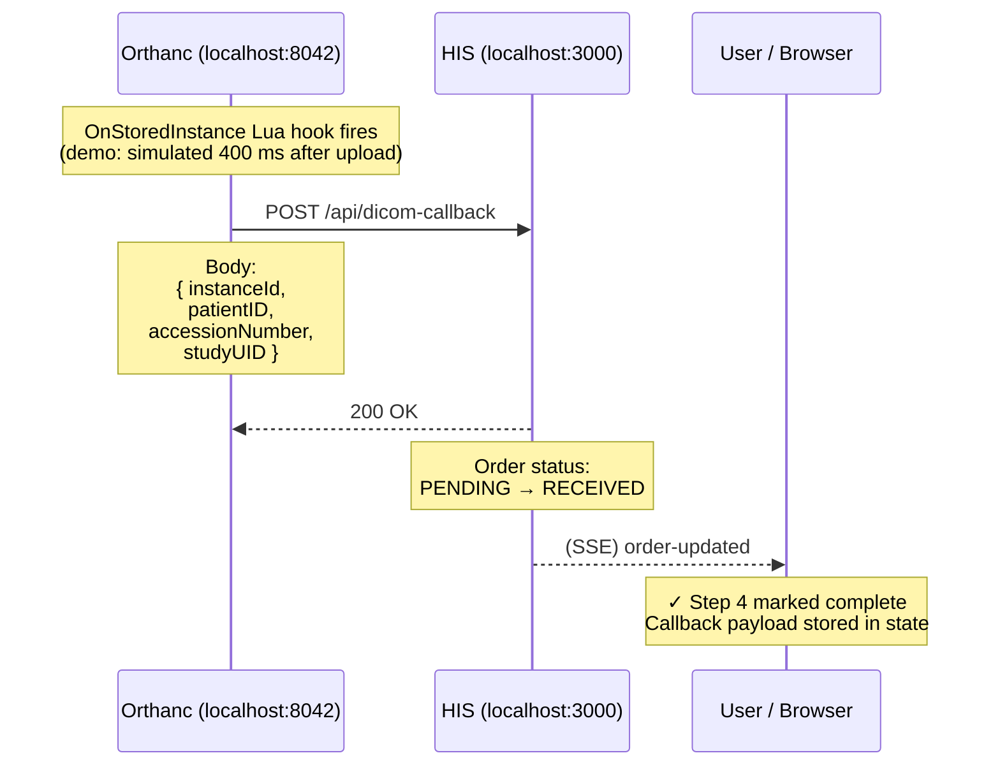

# E. Step 4 — Orthanc Lua Callback → HIS

Orthanc's `OnStoredInstance` Lua hook fires after every saved instance and POSTs a notification to HIS. In the demo this is simulated with a 400 ms delay after the upload. HIS transitions the order from `PENDING` → `RECEIVED`.

