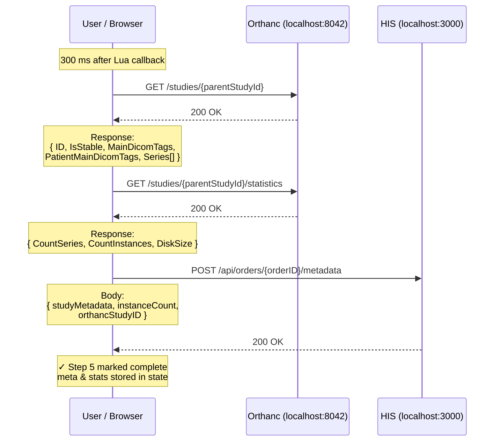

# F. Step 5 — HIS Queries Orthanc for Metadata

Using the `ParentStudy` UUID from the upload response, the UI fetches full study metadata and statistics from Orthanc, then stores them back in HIS. Starts 300 ms after the Lua callback.

