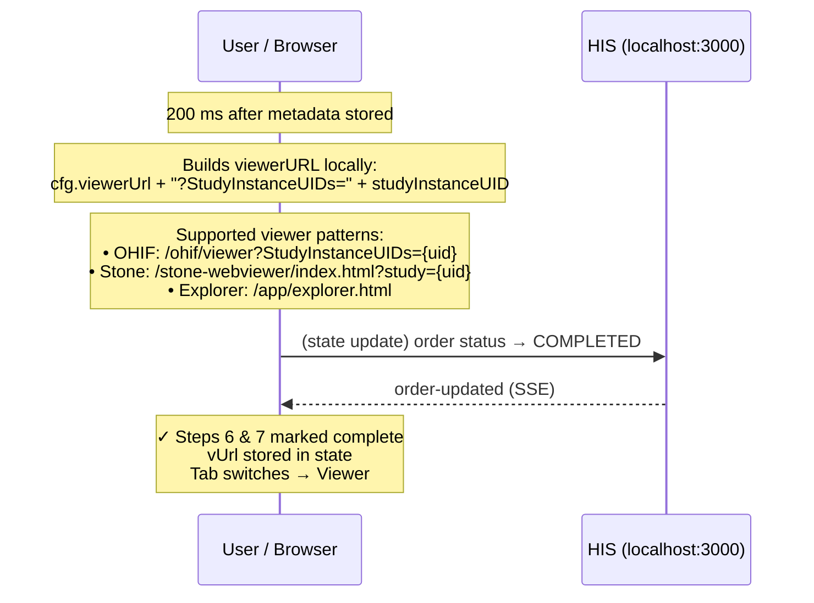

# G. Step 6 — Viewer URL Ready

HIS constructs the viewer URL from the configured base URL and the `StudyInstanceUID` extracted from the study metadata. Order status transitions to `COMPLETED`. Runs 200 ms after metadata is stored.

