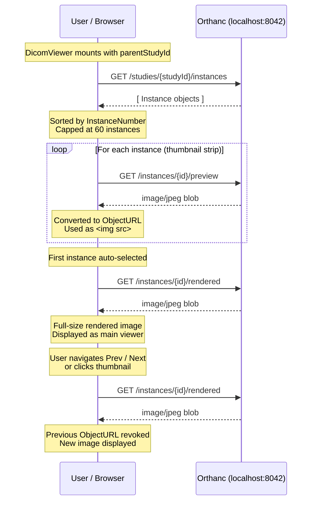

# H. Step 7 — View Images in Iframe

The Viewer tab loads all instances for the study, fetches JPEG thumbnails for the strip, and streams the full rendered image for the selected instance.

```mermaid
sequenceDiagram
    participant U as User / Browser
    participant ORT as Orthanc (localhost:8042)

    Note over U: DicomViewer mounts with parentStudyId

    U->>ORT: GET /studies/{studyId}/instances
    ORT-->>U: [ Instance objects ]
    Note over U: Sorted by InstanceNumber<br/>Capped at 60 instances

    loop For each instance (thumbnail strip)
        U->>ORT: GET /instances/{id}/preview
        ORT-->>U: image/jpeg blob
        Note over U: Converted to ObjectURL<br/>Used as <img src>
    end

    Note over U: First instance auto-selected

    U->>ORT: GET /instances/{id}/rendered
    ORT-->>U: image/jpeg blob
    Note over U: Full-size rendered image<br/>Displayed as main viewer

    Note over U: User navigates Prev / Next<br/>or clicks thumbnail

    U->>ORT: GET /instances/{id}/rendered
    ORT-->>U: image/jpeg blob
    Note over U: Previous ObjectURL revoked<br/>New image displayed
```
