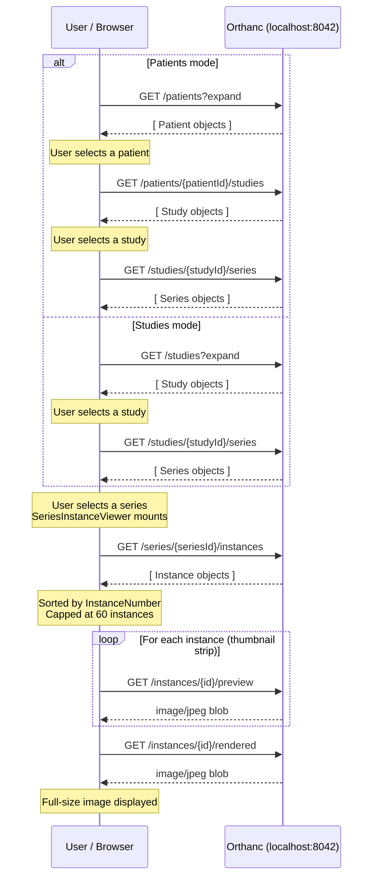

# I. Browser Tab — Hierarchical DICOM Exploration

The Browser tab supports two modes. **Patients mode** drills down through Patient → Study → Series → Instance. **Studies mode** starts at Study → Series → Instance.

