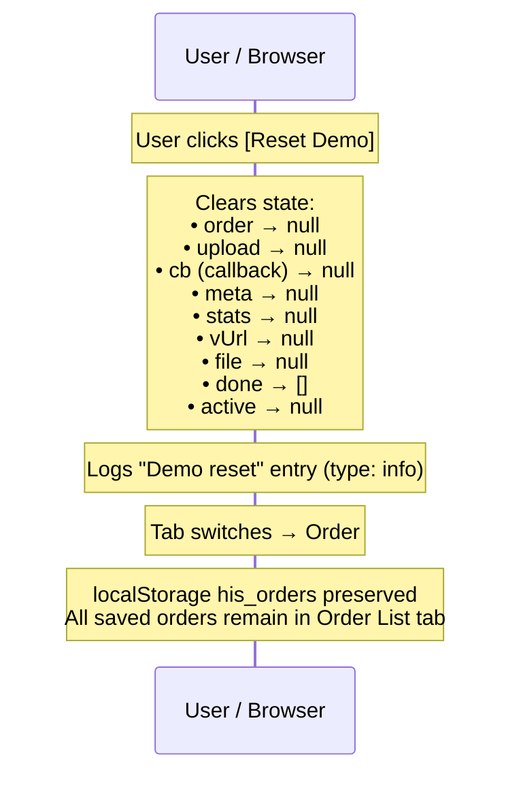

# J. Reset Workflow

Clears all in-memory workflow state and returns the UI to Step 1. No network calls are made. The orders list in localStorage is preserved.

```mermaid
sequenceDiagram
    participant U as User / Browser

    Note over U: User clicks [Reset Demo]

    Note over U: Clears state:<br/>• order → null<br/>• upload → null<br/>• cb (callback) → null<br/>• meta → null<br/>• stats → null<br/>• vUrl → null<br/>• file → null<br/>• done → []<br/>• active → null

    Note over U: Logs "Demo reset" entry (type: info)
    Note over U: Tab switches → Order
    Note over U: localStorage his_orders preserved<br/>All saved orders remain in Order List tab
```
